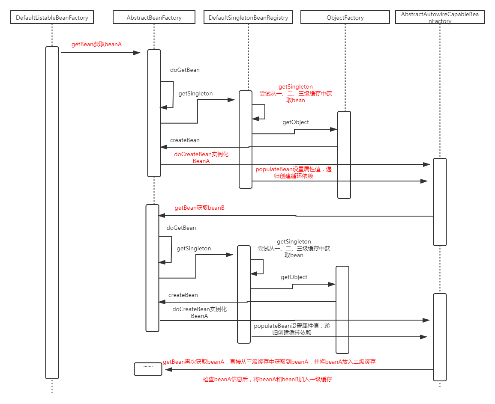

## 一.自定义@Service、@Autowired、@Transactional注解类，完成基于注解的IOC容器（Bean对象创建及依赖注入维护）和声明式事务控制。

写到转账工程中，并且可以实现转账成功和转账异常时事务回滚

注意以下情况：

1）注解有无value属性值【@service(value="" @Repository(value=""))】

2）service层是否实现接口的情况【jdk还是cglib】

**代码地址：**

[Spring源码作业](https://github.com/chao96/0406_spring)

**实现思路：**

①自定义注解@Autowired、@Bean、@Repository、@Service、@Transactional

② 在BeanFactory中扫描com.lagou.edu包下有相应注解的类，加入到map

③实现成员变量的依赖注入

+ 方法一：通过反射直接给字段赋值
+ 方法二：通过反射调用set方法赋值

④实现bean的增强，添加事务控制

## 二.记录spring循环依赖处理机制中的调用关系，画出UML时序图

**UML时序图：**

**额外补充：**

### 1.spring解决循环依赖的方式

**①构造器参数循环依赖**（无法解决）

构造器注入构成的循环依赖无法解决，只能抛出抛出BeanCurrentlyIn CreationException异常表示循环依赖。

**②set方式-单例**

采用提前暴露对象的方式。先将Bean对象实例化之后再设置对象属性

**③set方式-原型**（无法解决）

prototype作用域bean，Spring容器无法完成依赖注入，因为Spring容器不进行缓存prototype作用域的bean，因此无法提前暴露一个创建中的bean。
